# Solution Architecture

## Executive Summary

PHProjekt is an enterprise-grade open-source project management and collaboration platform developed by Mayflower GmbH. Released under the LGPL v3 license, it provides organizations with comprehensive tools for managing projects, tracking time, scheduling calendar events, and coordinating team activities. The system follows a modular architecture built on proven enterprise Java patterns adapted for PHP, enabling extensibility through dynamically loadable modules while maintaining a cohesive user experience through a rich JavaScript-based interface.

The architecture of PHProjekt is fundamentally based on the Model-View-Controller (MVC) pattern as implemented by Zend Framework 1. This architectural decision provides a solid foundation for separating business logic from presentation concerns, enabling the development team to build complex workflows while maintaining code organization and testability. The system leverages Zend Framework's component ecosystem for critical infrastructure concerns including database abstraction, authentication, access control, and routing, allowing the development team to focus on domain-specific functionality rather than reinventing foundational capabilities.

PHProjekt version 6.x represents a significant evolution from its predecessor, incorporating modern web application patterns including RESTful API design, AJAX-driven user interactions, and standards-based calendar integration through CalDAV. The frontend architecture relies heavily on the Dojo Toolkit, a comprehensive JavaScript framework that provides enterprise-grade UI widgets, data binding, and application structure. This separation between a PHP-based backend API and a JavaScript-based frontend creates a logical architecture that supports both human users through the web interface and potential machine clients through programmatic API access.

The system's design emphasizes flexibility and extensibility through several key architectural choices. Projects are organized in a hierarchical tree structure allowing unlimited nesting depth, permissions are managed through a sophisticated role-based access control system with item-level granularity, and the module system enables administrators to dynamically create and configure new functional areas without modifying core code. This combination of hierarchical data modeling, fine-grained security, and modular extensibility makes PHProjekt suitable for organizations ranging from small teams to large enterprises with complex organizational structures and diverse workflow requirements.

## System Overview

PHProjekt serves as a comprehensive groupware solution designed to support the complete lifecycle of project-based work within organizations. At its core, the system provides functionality for creating and managing hierarchical project structures where each project can contain unlimited sub-projects, enabling organizations to mirror their actual organizational structure and work breakdown hierarchies within the software. Each project serves as a container and security boundary, with administrators able to define which modules are available within specific projects and which users have access to view or modify project contents. This project-centric approach ensures that all work—whether time entries, calendar events, or custom data—exists within an appropriate organizational context with proper access controls applied.

The system's functionality is delivered through five primary modules that work together to provide integrated project management capabilities. The Core module handles foundational concerns including user management, role definition, module administration, and system configuration, providing administrators with centralized control over the entire platform. The Default module establishes common functionality shared across all other modules, including authentication, global search, tagging, file upload handling, and standardized CRUD operations for data entities. The Project module implements the hierarchical project structure and associated permissions, allowing project managers to organize work and control access at granular levels. The Calendar2 module provides sophisticated scheduling capabilities with support for recurring events and standards-based CalDAV synchronization, enabling integration with external calendar clients like Outlook and Google Calendar. Finally, the Timecard module enables time tracking against projects with support for vacation management and time sheet reporting, with its own CalDAV backend allowing time entries to appear in external calendar applications.

Beyond these core capabilities, PHProjekt implements a sophisticated Module Designer that allows administrators to create entirely new modules through a web-based interface without writing code. This meta-programming capability enables organizations to adapt the system to their specific workflows and data requirements, defining custom fields, validation rules, and list views that integrate seamlessly with the existing security and navigation infrastructure. The system maintains a complete audit trail through its History subsystem, recording all changes to data entities with timestamps and user attribution. A real-time notification system built on database polling delivers messages to users when relevant events occur, such as project updates or calendar invitations. This rich feature set, combined with support for multiple languages (German, English, and Spanish) and extensive configuration options, positions PHProjekt as a flexible platform capable of supporting diverse organizational needs while maintaining a consistent and professional user experience.

## Technology Stack

| Component Type | Technology | Version | Purpose |
|---|---|---|---|
| Programming Language | PHP | 5.3+ | Server-side application logic and business rules |
| MVC Framework | Zend Framework | 1.10.7 | Application structure, routing, database abstraction, authentication |
| JavaScript Framework | Dojo Toolkit | 1.6.x | Client-side UI widgets, AJAX communication, data binding |
| CalDAV/WebDAV Server | SabreDAV | 1.6.2 | Standards-based calendar and time tracking synchronization |
| Database Support | MySQL/PostgreSQL | Various | Relational data persistence with abstraction layer |
| Data Visualization | D3.js | 3.x | Charts and visual data representations |
| JavaScript Minification | ShrinkSafe | Bundled | Code compression for production deployment |
| Testing Framework | PHPUnit | 3.7.x | Unit and integration testing |
| Testing Framework | DBUnit | 1.2+ | Database-driven test scenarios |
| Dependency Management | Composer | N/A | PHP package management and autoloading |
| HTML Sanitization | HTMLPurifier | Bundled | XSS protection for user-generated content |
| Code Compression | Minify | Bundled | CSS and JavaScript asset optimization |

The technology stack for PHProjekt reflects careful consideration of enterprise requirements including stability, community support, and comprehensive feature sets. Zend Framework 1 was chosen as the foundation because it provides a mature, well-documented component library with enterprise adoption and long-term support commitments. While newer PHP frameworks have emerged since this version was developed, Zend Framework 1 offered the stability and completeness required for a system managing critical business data. The framework's use of established design patterns (Front Controller, Table Data Gateway, Registry) creates familiar structures for developers coming from Java or .NET backgrounds, reducing the learning curve for enterprise development teams.

The selection of Dojo Toolkit for the frontend, while less common than jQuery in many PHP applications, demonstrates a commitment to building sophisticated single-page application experiences. Dojo provides enterprise-grade widgets including data grids, form validation, tree views, and dialog boxes with accessibility support and comprehensive API documentation. The framework's package system and build tools enable modular development of JavaScript code with production optimization through concatenation and minification. The integration of SabreDAV represents adherence to open standards, allowing PHProjekt to interoperate with the broader ecosystem of CalDAV clients rather than requiring users to work exclusively within the web interface. This standards-based approach to calendar integration demonstrates architectural maturity and recognition that enterprise systems must integrate with existing tools rather than demanding wholesale replacement of user workflows.

## Architecture Overview

PHProjekt implements a classic three-tier architecture with distinct presentation, business logic, and data access layers, following the Model-View-Controller pattern throughout. The presentation layer consists of Dojo-based JavaScript applications that run in the user's browser, communicating with the server exclusively through AJAX requests to RESTful endpoints. The business logic layer is implemented in PHP using Zend Framework's MVC components, with each functional module providing its own controllers for handling requests and models for encapsulating business rules and data access. The data access layer abstracts database interactions through Zend_Db, providing portability across different relational database systems while maintaining consistent query interfaces and connection management throughout the application.

The modular architecture allows the system to be extended with new functionality without modifying core code, following the Open-Closed Principle from SOLID design. Each module is self-contained with its own directory structure containing controllers, models, views, language files, and database schema definitions in JSON format. The core Phprojekt class bootstraps the application by loading configuration, establishing database connections, initializing the module registry, and dispatching incoming requests to the appropriate module controller. A custom routing system maps RESTful URLs to controller actions, enabling clean URLs like `/Calendar2/index/jsonList` where the first segment identifies the module, the second identifies the controller, and the third identifies the action method. This convention-over-configuration approach reduces boilerplate while maintaining flexibility through optional route customization.

The architecture demonstrates strong separation of concerns through well-defined boundaries between system layers and functional modules. Authentication and authorization are handled by dedicated subsystems (Phprojekt_Auth and Phprojekt_Acl respectively) that integrate with Zend Framework's security components while adding project-aware permission checking. Data persistence follows the Active Record pattern through the Phprojekt_Item_Abstract base class, providing models with built-in CRUD operations, validation, and event hooks for lifecycle management. The tree structure for projects is implemented through a specialized Phprojekt_Tree_Node_Database class that encapsulates hierarchical operations including parent-child traversal, depth calculation, and subtree operations, abstracting the complexity of recursive data structures behind a clean object-oriented interface. This layered approach with clear abstractions enables developers to work at appropriate levels of abstraction, whether implementing high-level business workflows or optimizing low-level database queries.

### C4 Component Diagram (Level 3)

```mermaid
graph TD
    subgraph "Browser Environment"
        UI[Dojo UI Layer]
        Store[Data Stores]
        Widget[Dojo Widgets]
    end

    subgraph "PHProjekt Application Server"
        Bootstrap[Phprojekt Bootstrap]
        Router[Request Router/Dispatcher]

        subgraph "Core Module"
            CoreCtrl[Core Controllers]
            UserMgmt[User Management]
            RoleMgmt[Role Management]
            ModuleMgmt[Module Management]
            SettingsMgmt[Settings Management]
        end

        subgraph "Default Module"
            DefaultCtrl[Default Controllers]
            Auth[Authentication]
            Search[Search Engine]
            Tags[Tag System]
            Upload[File Upload Handler]
        end

        subgraph "Project Module"
            ProjCtrl[Project Controllers]
            ProjModel[Project Models]
            TreeMgmt[Hierarchical Tree Manager]
            PermMgmt[Permission Management]
        end

        subgraph "Calendar2 Module"
            CalCtrl[Calendar Controllers]
            CalModel[Calendar Models]
            CalDAV[CalDAV Backend]
            RRule[Recurrence Handler]
        end

        subgraph "Timecard Module"
            TimeCtrl[Timecard Controllers]
            TimeModel[Timecard Models]
            TimeDAV[Time CalDAV Backend]
            VacationMgmt[Vacation Management]
        end

        subgraph "Infrastructure Layer"
            ACL[Access Control List]
            DBManager[Database Manager]
            History[History/Audit Trail]
            Cache[Cache Manager]
            Logger[Logging System]
        end
    end

    subgraph "Data Layer"
        DB[(Relational Database)]
        Files[File Storage]
    end

    subgraph "External Systems"
        CalClient[CalDAV Clients]
        ExtApps[External Applications]
    end

    UI --> Router
    Store --> Router
    Widget --> UI

    Router --> CoreCtrl
    Router --> DefaultCtrl
    Router --> ProjCtrl
    Router --> CalCtrl
    Router --> TimeCtrl

    Bootstrap --> Router
    Bootstrap --> ACL
    Bootstrap --> Cache
    Bootstrap --> Logger

    CoreCtrl --> UserMgmt
    CoreCtrl --> RoleMgmt
    CoreCtrl --> ModuleMgmt
    CoreCtrl --> SettingsMgmt

    DefaultCtrl --> Auth
    DefaultCtrl --> Search
    DefaultCtrl --> Tags
    DefaultCtrl --> Upload

    ProjCtrl --> ProjModel
    ProjCtrl --> TreeMgmt
    ProjCtrl --> PermMgmt

    CalCtrl --> CalModel
    CalCtrl --> CalDAV
    CalCtrl --> RRule

    TimeCtrl --> TimeModel
    TimeCtrl --> TimeDAV
    TimeCtrl --> VacationMgmt

    UserMgmt --> ACL
    RoleMgmt --> ACL
    Auth --> ACL
    PermMgmt --> ACL

    ProjModel --> DBManager
    CalModel --> DBManager
    TimeModel --> DBManager
    UserMgmt --> DBManager
    RoleMgmt --> DBManager

    DBManager --> DB
    DBManager --> History
    Upload --> Files

    CalDAV --> CalClient
    TimeDAV --> CalClient
    Router --> ExtApps

    Search --> DB
    Tags --> DB
    History --> DB
```

### Component Descriptions

#### Phprojekt Bootstrap

The Phprojekt Bootstrap component serves as the application's initialization and configuration hub, implementing the Singleton pattern to ensure a single consistent application state throughout request processing. When a request arrives at the index.php entry point, the bootstrap component loads the configuration file to determine database credentials, paths for file uploads and temporary storage, logging preferences, and caching strategies. It establishes the database connection using Zend Framework's adapter pattern, which provides abstraction over MySQL and PostgreSQL while maintaining consistent query interfaces and result handling. The bootstrap also initializes the logging system with configurable destinations and severity levels, sets up the caching layer using Zend_Cache with support for various backends including file-based and memory-based storage, and registers the view renderer for template processing. This centralized initialization ensures that all subsequent application components have access to properly configured services through the registry pattern, avoiding the need for global variables or repeated configuration loading.

#### Request Router and Dispatcher

The Request Router and Dispatcher component implements the Front Controller pattern, providing a single entry point for all HTTP requests and managing the routing logic that maps URLs to specific controller actions within modules. The custom Phprojekt_RestRoute class extends Zend Framework's routing capabilities to support RESTful URL conventions where the URL structure `/module/controller/action` directly maps to the corresponding PHP class and method. The dispatcher handles both traditional page requests and AJAX requests, with special handling for actions prefixed with "json" that return data in JSON format for consumption by the Dojo frontend. It also implements security checks at the routing level, verifying that users have permission to access the requested module before instantiating controllers and invoking action methods. The dispatcher integrates with the access control system to enforce both module-level and item-level permissions, ensuring that authorization is consistently applied regardless of how users attempt to access resources. Error handling is centralized through the dispatcher, which catches exceptions thrown by controllers or models and routes them to the ErrorController for appropriate user-facing error messages and developer-focused logging.

#### Core Module

The Core Module provides administrative functionality essential for system operation and governance, serving as the control plane for the entire PHProjekt installation. User Management functionality allows administrators to create user accounts, set passwords, configure email addresses for notifications, assign default language preferences, and control account activation status. The Role Management subsystem defines organizational roles with associated permission templates, establishing which modules each role can access and what default access levels role members receive to new items created within projects. Module Management tracks all installed modules, their activation status, version numbers, and configuration parameters, enabling administrators to control which functionality is available to users and how modules integrate with the project hierarchy. Settings Management provides both system-wide configuration options and user-specific preferences, storing key-value pairs in the database that control behavior ranging from date formats and time zones to notification preferences and interface customization. The Core Module interacts heavily with the Infrastructure Layer, particularly the Access Control List system, to ensure that administrative changes are immediately reflected in permission checks throughout the application.

#### Default Module

The Default Module establishes foundational capabilities that are inherited or utilized by all other modules in the system, providing shared infrastructure that ensures consistency across functional areas. The Authentication subsystem integrates with Zend_Auth to manage user login sessions, password validation, session timeout handling, and logout procedures, maintaining security tokens that are validated on each subsequent request. The Search Engine provides full-text search capabilities across all modules, maintaining search indices that are updated whenever items are created or modified, and returning results formatted with module context and permission filtering to ensure users only see items they have access to. The Tag System implements a simple but powerful categorization mechanism allowing users to attach arbitrary text labels to items across different modules, with tag clouds and filtering capabilities that help users navigate large collections of projects, calendar events, and time entries. File Upload Handler manages the complex workflow of accepting multipart form data containing files, validating file types and sizes against configured limits, storing files in the designated upload directory with sanitized names, and recording metadata in the database that links uploaded files to their parent items. All other modules extend the controllers and helpers provided by the Default Module, ensuring that common operations like JSON serialization, CSV export, error handling, and permission checking follow consistent patterns throughout the application.

#### Project Module

The Project Module implements the hierarchical project structure that serves as the organizational backbone of the entire PHProjekt system, providing the context within which all other work occurs. Projects are modeled as nodes in a tree structure with unlimited nesting depth, where each project can have a single parent and multiple children, creating an organizational hierarchy that can mirror departmental structures, program portfolios, or work breakdown hierarchies. The Hierarchical Tree Manager component handles the complexity of recursive operations on this structure, including traversing ancestor chains to accumulate permissions, finding all descendants of a project for bulk operations, preventing circular references that would create infinite loops, and efficiently loading subtrees to populate navigation interfaces. The Permission Management subsystem extends the basic role-based access control with project-specific overrides, allowing project owners to grant or restrict access to specific users or roles for their projects and all contained items. Projects serve as configuration containers, defining which modules are available within their scope—a project manager might enable Calendar and Timecard modules for an active project while disabling them for an archived project. The Project Models encapsulate business rules including validation logic that prevents projects from being moved under their own descendants, access control checks that verify users have appropriate permissions before allowing modifications, and cascade operations that handle the complex workflow when projects are deleted or moved within the hierarchy.

#### Calendar2 Module

The Calendar2 Module provides sophisticated event scheduling capabilities that extend beyond simple date and time tracking to support recurring events, participant management, and standards-based synchronization with external calendar applications. The Calendar Controllers handle web interface operations including creating and editing events through forms, displaying events in various views such as day, week, and month layouts, managing participant invitations and responses, and serving calendar data in formats optimized for the Dojo-based UI components. The Calendar Models represent individual events with properties including title, description, start and end times, location, participant lists, visibility settings, and recurrence rules, implementing validation logic that ensures events have valid date ranges and that recurring events follow syntactically correct recurrence patterns. The Recurrence Handler interprets RRULE specifications from the iCalendar standard (RFC 5545), expanding recurring event definitions into individual occurrence instances for display purposes while maintaining the underlying rule definition for efficient storage and editing. The CalDAV Backend implements the CalDAV protocol using SabreDAV libraries, exposing calendars as WebDAV collections that can be subscribed to by external clients like Apple Calendar, Mozilla Thunderbird, or Microsoft Outlook, maintaining bidirectional synchronization where changes made in external clients are reflected in PHProjekt and vice versa. This standards-based approach enables users to manage their PHProjekt calendar events within their preferred calendar application while maintaining proper permission checks and ensuring that event data remains securely stored within the PHProjekt database.

#### Timecard Module

The Timecard Module enables comprehensive time tracking against projects with support for vacation management and integration with payroll or billing systems through export capabilities. Time entries record the fundamental information needed for project accounting including start and end times, project assignment, description of work performed, and optional tagging for categorization by activity type or cost center. The Timecard Controllers provide interfaces for entering time either through start/stop timers for live tracking or through manual entry of historical time blocks, displaying accumulated time in various aggregations such as daily summaries, weekly time sheets, or project totals, and enforcing business rules such as preventing overlapping time entries or requiring minimum descriptions. The Vacation Management functionality tracks employee time off including vacation days, sick leave, and other absence types, calculating balances based on configured accrual policies and approval workflows. Similar to the Calendar2 Module, the Timecard Module includes its own CalDAV Backend (TimeDAV) that exposes time entries as calendar events, enabling users to see their logged work time within external calendar applications and providing visual confirmation of time tracking completeness. The tight integration between Timecard and Project modules ensures that time can only be logged against projects where users have appropriate permissions, that time entries are included in project-level reports and dashboards, and that project managers can review time logged by team members for approval or billing purposes.

#### Infrastructure Layer

The Infrastructure Layer provides cross-cutting concerns that are utilized throughout the application by all functional modules, implementing technical capabilities that are essential for security, performance, maintainability, and operational visibility. The Access Control List (ACL) system implements fine-grained permission checking at both the module level (can a user access the Calendar module at all?) and the item level (can a user edit this specific calendar event?), integrating with the role management system to provide permission templates while allowing item-level overrides for specific scenarios. The Database Manager provides comprehensive database abstraction through Zend_Db while adding PHProjekt-specific capabilities including schema management from JSON definitions, database migration execution during upgrades, query logging for performance analysis, and connection pooling for efficient resource utilization. The History subsystem maintains a complete audit trail of all changes to data entities, recording the user who made each change, the timestamp when it occurred, the field that was modified, and both the old and new values, providing compliance capabilities for organizations that must demonstrate who accessed or modified sensitive information. The Cache Manager wraps Zend_Cache to provide application-specific caching strategies for expensive operations like permission calculations across deep project hierarchies, search index lookups, and configuration value retrieval, with intelligent invalidation that clears cached data when underlying database records change. The Logging System directs application logs to configured destinations with severity-based filtering, enabling developers to include detailed diagnostic logging that can be enabled selectively in production environments when troubleshooting issues without overwhelming log files with routine informational messages during normal operation.

### C4 Code Diagram (Level 4)

```mermaid
classDiagram
    class Phprojekt {
        -Zend_Config_Ini _config
        -Zend_Db _db
        -Phprojekt_Log _log
        -Zend_Cache _cache
        -Zend_View _view
        +getInstance() Phprojekt
        +run() void
        +getConfig() Zend_Config_Ini
        +getDb() Zend_Db
        +translate(string) string
    }

    class Phprojekt_Dispatcher {
        -Zend_Controller_Front _front
        +dispatch() void
        +setRoutes() void
    }

    class Phprojekt_RestRoute {
        +match(string) array
        +assemble(array) string
    }

    class IndexController {
        +jsonListAction() void
        +jsonDetailAction() void
        +jsonSaveAction() void
        +jsonDeleteAction() void
        -getModelObject() Phprojekt_Item_Abstract
        -setCurrentProjectId() void
    }

    class Phprojekt_Item_Abstract {
        #Zend_Db_Table _table
        #array _data
        #Phprojekt_ModelInformation_Interface _informationManager
        +find(int) Phprojekt_Item_Abstract
        +save() void
        +delete() void
        +toArray() array
        +recordValidate() boolean
        #_preSave() void
        #_postSave() void
    }

    class Phprojekt_ActiveRecord_Abstract {
        #array _data
        #boolean _isNewRecord
        +__get(string) mixed
        +__set(string, mixed) void
        +fetchAll() array
        +saveRights(array) void
    }

    class Project_Models_Project {
        +hasMany array
        +validateProjectId(int) string
        +saveModulePermissions(array) void
        +getProjectModulePermissions() array
        -_isInTheProject(int, node) boolean
    }

    class Calendar2_Models_Calendar2 {
        +rrule string
        +participants array
        +expandRecurrence(start, end) array
        +validateDateRange() string
    }

    class Timecard_Models_Timecard {
        +startDatetime datetime
        +endDatetime datetime
        +projectId int
        +validateOverlap() string
        +calculateDuration() float
    }

    class Phprojekt_Tree_Node_Database {
        -Phprojekt_Item_Abstract _activeRecord
        -int _id
        -array _children
        +setup() Phprojekt_Tree_Node_Database
        +getChildren() array
        +hasChildren() boolean
        +getParent() Phprojekt_Tree_Node_Database
        +getPath() array
    }

    class Phprojekt_Acl {
        -Zend_Acl _acl
        +__construct(User, Role)
        +isAllowed(module, action) boolean
        +getAccessLevel(item) int
    }

    class Phprojekt_Auth {
        -Zend_Auth _auth
        +authenticate(username, password) boolean
        +hasIdentity() boolean
        +getIdentity() User
        +logout() void
    }

    class Phprojekt_DatabaseManager {
        -Zend_Db _db
        +createTable(tableName, schema) void
        +updateTable(tableName, migration) void
        +getTableFields(tableName) array
        +parseJsonSchema(json) array
    }

    class Phprojekt_User_User {
        +username string
        +email string
        +status string
        +getSetting(key) string
        +saveSetting(key, value) void
    }

    class Phprojekt_Role_Role {
        +name string
        +getModulePermissions() array
        +saveModulePermissions(array) void
    }

    class Phprojekt_History {
        +save(model, field, oldValue, newValue) void
        +getHistoryData(moduleId, itemId) array
    }

    class Phprojekt_Search {
        +indexItem(item) void
        +deleteItem(moduleId, itemId) void
        +search(query) array
        +searchModuleByWord(module, words) array
    }

    class CalDAV_CalendarBackend {
        -Phprojekt_Item_Abstract _model
        +getCalendarsForUser(principal) array
        +getCalendarObjects(calendarId) array
        +createCalendarObject(calendarId, data) void
        +updateCalendarObject(objectId, data) void
    }

    Phprojekt <|-- Phprojekt_Dispatcher
    Phprojekt_Dispatcher --> Phprojekt_RestRoute
    Phprojekt_Dispatcher --> IndexController

    IndexController <|-- Default_IndexController
    IndexController <|-- Project_ProjectController
    IndexController <|-- Calendar2_IndexController
    IndexController <|-- Timecard_TimecardController

    Phprojekt_ActiveRecord_Abstract <|-- Phprojekt_Item_Abstract
    Phprojekt_Item_Abstract <|-- Project_Models_Project
    Phprojekt_Item_Abstract <|-- Calendar2_Models_Calendar2
    Phprojekt_Item_Abstract <|-- Timecard_Models_Timecard
    Phprojekt_Item_Abstract <|-- Phprojekt_User_User
    Phprojekt_Item_Abstract <|-- Phprojekt_Role_Role

    IndexController --> Phprojekt_Item_Abstract
    IndexController --> Phprojekt_Acl

    Project_Models_Project --> Phprojekt_Tree_Node_Database

    Phprojekt --> Phprojekt_Auth
    Phprojekt --> Phprojekt_DatabaseManager
    Phprojekt --> Phprojekt_History
    Phprojekt --> Phprojekt_Search

    Phprojekt_Auth --> Phprojekt_User_User
    Phprojekt_Acl --> Phprojekt_User_User
    Phprojekt_Acl --> Phprojekt_Role_Role

    Calendar2_IndexController --> CalDAV_CalendarBackend
    Timecard_TimecardController --> CalDAV_CalendarBackend

    Phprojekt_Item_Abstract --> Phprojekt_History
    Phprojekt_Item_Abstract --> Phprojekt_Search

    CalDAV_CalendarBackend --> Calendar2_Models_Calendar2
```

### Key Classes and Modules

#### Phprojekt (Singleton Bootstrap)

The Phprojekt class serves as the central orchestrator and service locator for the entire application, implementing the Singleton pattern to ensure consistent access to configuration and shared resources throughout request processing. When the static getInstance() method is called, it either returns an existing instance or creates a new one, loading the configuration file specified by the PHPR_CONFIG_SECTION constant to determine database credentials, file paths, and system preferences. The run() method serves as the main entry point after instantiation, setting up include paths for the Zend Framework and custom libraries, establishing the database connection through Zend_Db::factory() which instantiates the appropriate adapter based on configuration, initializing logging with Phprojekt_Log, and ultimately invoking the dispatcher to route the request to the appropriate controller. The class provides accessor methods like getConfig(), getDb(), and getLog() that enable other components to retrieve these shared resources without requiring direct references or global variables, maintaining clean dependency management. The translate() method provides a convenient wrapper around the multi-language translation system, allowing any component to retrieve localized strings by key. This centralized bootstrap approach ensures that the application initializes consistently regardless of entry point, with all necessary services properly configured before business logic executes.

#### Phprojekt_Item_Abstract (Active Record Base)

The Phprojekt_Item_Abstract class provides the foundation for all data models in the system, implementing the Active Record pattern where each instance represents a single row in a database table and provides methods for persistence operations. The class manages an internal _data array that holds field values, implementing PHP's magic __get() and __set() methods to provide object property syntax for accessing these fields while maintaining the flexibility to add new fields without modifying class definitions. The find() method loads a record by primary key, executing a database query through the Zend_Db_Table abstraction and populating the _data array with the result, while the save() method determines whether to INSERT a new record or UPDATE an existing one based on whether the instance has an ID value. The delete() method removes the record from the database while also triggering cascade operations on related records and updating search indices. The class implements template methods including _preSave() and _postSave() that subclasses can override to add custom behavior at specific points in the lifecycle, such as validating business rules before persistence or sending notifications after successful saves. The recordValidate() method orchestrates validation by calling individual validate methods for each field, collecting error messages, and preventing saves when validation fails. Integration with Phprojekt_History happens automatically in the save() method, which compares old and new values for tracked fields and records changes to the audit log. This rich base class eliminates repetitive CRUD boilerplate while providing extension points for domain-specific behavior.

#### IndexController (Base Controller)

The IndexController class serves as the abstract base for all module controllers, providing standardized action methods that handle common CRUD operations through a RESTful JSON interface consumed by the Dojo frontend. The jsonListAction() method queries the database for all items visible to the current user within the active project, applying permission filters and returning results as a JSON array with each item serialized through the model's toArray() method. The jsonDetailAction() retrieves a single item by ID, performing permission checks to ensure the current user has read access before serializing and returning the item data. The jsonSaveAction() handles both creation and updates by accepting JSON-encoded form data from POST requests, instantiating the appropriate model, populating it with submitted values, calling recordValidate() to check business rules, and persisting through the save() method if validation succeeds. The jsonDeleteAction() retrieves an item by ID, verifies the user has delete permissions, and calls the model's delete() method, catching any exceptions thrown if referential integrity prevents deletion. These standardized actions can be used without modification by many modules, while more complex modules like Project or Calendar2 extend IndexController and add additional actions for specialized operations like moving projects in the hierarchy or expanding recurring calendar events. The getModelObject() template method instantiated the appropriate model class for the current module, leveraging naming conventions where the Project module's controller returns instances of Project_Models_Project, enabling the base controller to work polymorphically with different entity types.

#### Project_Models_Project (Project Entity)

The Project_Models_Project class represents individual projects within the hierarchical project tree, extending Phprojekt_Item_Abstract with domain-specific business logic for managing organizational structures and permissions. The class declares a hasMany relationship with Project_Models_ProjectModulePermissions, establishing that each project can have multiple module permission records that control which functional modules are available within the project's scope. The validateProjectId() method implements complex business rules preventing circular references in the project hierarchy, using the Phprojekt_Tree_Node_Database class to traverse the tree and verify that a project is not being set as its own descendant, which would create infinite loops during tree traversal operations. The saveModulePermissions() method handles the intricate workflow of updating which modules are enabled for a project, deleting all existing permission records and inserting new ones in a transaction to maintain consistency. The getProjectModulePermissions() method retrieves the current set of enabled modules by querying the junction table and returning results as an array suitable for rendering in admin interfaces. The integration with Phprojekt_Tree_Node_Database enables projects to be manipulated as nodes in a tree structure, providing methods to find all descendants when applying bulk operations, traverse up to find ancestor projects when accumulating inherited permissions, and move subtrees when reorganizing the project hierarchy. This sophisticated model demonstrates how domain complexity is encapsulated within model classes, keeping controllers focused on HTTP concerns while business rules and data integrity are enforced at the appropriate layer.

#### Calendar2_Models_Calendar2 (Calendar Event Entity)

The Calendar2_Models_Calendar2 class represents calendar events with support for sophisticated features including recurring event patterns, participant management, and timezone handling according to iCalendar standards. The rrule property stores recurrence patterns in RRULE format as defined in RFC 5545, enabling specification of complex patterns like "every Tuesday and Thursday" or "the last Friday of every month" through a standardized syntax. The expandRecurrence() method interprets RRULE definitions to generate individual event instances within a specified date range, using the Helper_Rrule utility class to parse the rule and calculate occurrence dates, enabling the UI to display recurring events as if they were individual entries while maintaining the efficiency of storing only the rule definition. The participants property manages the relationship between events and attendees, tracking invitation status (accepted, declined, tentative) and maintaining email addresses for sending iCalendar invitation files. The validateDateRange() method ensures that event start times precede end times, that all-day events have appropriate time components, and that recurring events have valid recurrence patterns, preventing data inconsistencies that could cause display or synchronization errors. Integration with the CalDAV_CalendarBackend class enables this model to be synchronized with external calendar clients, with the backend translating between the database representation and iCalendar format including proper handling of VEVENT components, VALARM definitions for reminders, and VTIMEZONE specifications for handling events across multiple timezones.

#### Timecard_Models_Timecard (Time Entry Entity)

The Timecard_Models_Timecard class represents individual time tracking entries, capturing the information necessary for project accounting, billing, and reporting. The startDatetime and endDatetime properties record the precise time period being logged, stored with timezone information to handle users working across multiple time zones or daylight saving transitions. The projectId property establishes the foreign key relationship to the project tree, ensuring that time can only be logged against projects where the user has appropriate permissions and enabling project managers to query all time logged against their projects and sub-projects. The validateOverlap() method implements business rules preventing users from logging overlapping time entries, querying existing time records for the user within the proposed time range and returning validation errors if conflicts are detected. The calculateDuration() method computes the elapsed time between start and end, handling edge cases like entries spanning daylight saving transitions or midnight boundaries, returning results in hours as floating-point values suitable for summing in time sheet reports. The model integrates with the Vacation management subsystem by distinguishing between regular work time and time off, enabling calculations of work/life balance metrics and ensuring vacation days are properly accounted for in accrual and balance calculations. Similar to Calendar events, Timecard entries can be exposed through CalDAV by the TimeDAV backend, appearing in external calendar applications as events that visually represent when work was performed, providing users with a unified view of scheduled future work and historical completed work within a single calendar interface.

#### Phprojekt_Tree_Node_Database (Hierarchical Tree Manager)

The Phprojekt_Tree_Node_Database class encapsulates the complexity of managing hierarchical tree structures in a relational database, providing object-oriented operations on tree nodes backed by the adjacency list pattern where each record stores a reference to its parent. The setup() method initializes a node instance by loading the associated database record and caching frequently accessed values like parent ID and depth in the tree, enabling efficient traversal operations without repeated database queries. The getChildren() method retrieves all immediate child nodes by querying for records where parent_id matches the current node's ID, returning an array of Phprojekt_Tree_Node_Database instances that maintain the same interface as the parent, enabling recursive operations through uniform treatment of nodes at any depth. The hasChildren() method provides an efficient check for leaf nodes without materializing child objects, simply querying for the existence of child records. The getParent() method traverses up the tree by loading the parent node, with recursive calls enabling traversal to arbitrary ancestor levels or all the way to the root. The getPath() method returns the complete chain of ancestors from root to the current node, useful for rendering breadcrumb navigation or performing permission checks that accumulate across the hierarchy. This abstraction eliminates the need for application code to write recursive SQL queries or implement tree traversal algorithms, providing tested and optimized implementations of common tree operations while isolating the rest of the application from details of how hierarchical relationships are represented in the relational schema.

#### Phprojekt_Acl (Access Control)

The Phprojekt_Acl class implements the security model for PHProjekt, providing both coarse-grained module-level permissions and fine-grained item-level access control that integrates with the role system and project hierarchy. The class wraps Zend_Acl while adding PHProjekt-specific logic including project context awareness, where a user's permissions may vary depending on which project they are accessing. The constructor accepts User and Role instances, using them to build an access control list that represents all permissions the user has through their role assignments and any item-specific grants. The isAllowed() method checks whether the current user has permission to perform a specific action on a module, such as whether they can create new calendar events or edit existing ones, consulting both role-based permissions and project-level overrides to make the determination. The getAccessLevel() method determines the specific permission level (none, read, write, access, create, admin) that a user has for a particular item, traversing up the project tree to accumulate inherited permissions and applying item-specific grants that may elevate or restrict access beyond what the user's role provides. This multi-layered permission system enables flexible security policies where users might have administrative rights to projects they own, write access to projects they contribute to, and read-only access to projects they need to reference, with all permission checks enforced consistently whether users access data through the web UI, API calls, or CalDAV synchronization. The tight integration between Acl and the tree structure ensures that permission changes at high levels of the project hierarchy properly cascade to all contained projects and items without requiring manual propagation.

#### Phprojekt_DatabaseManager (Schema Management)

The Phprojekt_DatabaseManager class provides sophisticated database schema management capabilities that enable PHProjekt to define table structures in JSON format and apply them consistently across different database systems. The parseJsonSchema() method reads JSON files from each module's Sql directory, interpreting declarative schema definitions that specify table names, column names, data types, constraints, and indices without requiring hand-written SQL. The createTable() method generates appropriate CREATE TABLE statements for the configured database adapter, mapping generic type definitions like "varchar" or "int" to database-specific types and syntax, enabling the same schema definition to work with MySQL, PostgreSQL, or other supported databases. The updateTable() method handles schema migrations during upgrades, comparing the JSON definition against the current database structure, identifying differences like new columns or modified data types, and generating ALTER TABLE statements to bring the database into conformance with the desired schema. The getTableFields() method queries database metadata to retrieve the current structure of a table, providing the information necessary for comparison during migrations and for dynamic form generation in the Module Designer. This abstraction enables developers to work with database schemas at a higher level of abstraction than SQL, reduces errors from hand-written DDL statements, and ensures that the application can adapt to different database systems without maintaining multiple sets of schema definitions. The migration system maintains version tracking, recording which schema versions have been applied to prevent duplicate execution and enabling reliable upgrades from older PHProjekt versions to current releases.

## Design Patterns and Principles

PHProjekt demonstrates extensive use of established object-oriented design patterns drawn from Gang of Four classics and enterprise application architecture patterns popularized by Martin Fowler and others. The Model-View-Controller pattern provides the overarching structure separating presentation from business logic and data access, implemented through Zend Framework's MVC components with PHProjekt-specific conventions for module organization. Active Record pattern implementation in Phprojekt_Item_Abstract gives domain models responsibility for their own persistence, trading some separation of concerns for significant reduction in boilerplate code and improved developer productivity when working with straightforward CRUD operations. The Front Controller pattern centralizes request handling through a single entry point, enabling cross-cutting concerns like authentication, logging, and error handling to be applied uniformly regardless of which module handles the ultimate request. Singleton pattern usage in the Phprojekt bootstrap class ensures consistent application state and provides convenient access to shared resources without coupling components to specific implementations. Template Method pattern appears extensively in the controller and model hierarchies, where base classes define algorithmic structures with hook methods that subclasses override to customize specific steps while maintaining overall control flow.

The Strategy pattern manifests in the converter system where different output formats (JSON, CSV, PDF) are generated through interchangeable converter classes that share a common interface, allowing controllers to select the appropriate strategy based on request parameters. Registry pattern provides service location capabilities where the Zend_Registry holds references to shared objects like the database connection and configuration, enabling any component to access these services without requiring dependency injection throughout the call stack. Observer pattern implementation in the model lifecycle allows decoupled components like the history system and search indexer to react to entity changes without the models needing explicit knowledge of these observers. Decorator pattern extends model functionality in cases like Calendar2_Models_InformationDecoratorReadonly which wraps another model to modify its behavior for read-only scenarios. Factory pattern appears in model instantiation where controllers use string module names to create appropriate model instances, enabling generic controller code to work polymorphically with different entity types.

The architecture adheres to several SOLID principles despite being built with PHP rather than a language with stronger type systems and interface enforcement. Single Responsibility Principle is evident in the separation between controllers (HTTP concerns), models (business logic and persistence), and helper classes (specific algorithms like recurrence calculation), with each class having a clearly defined purpose. Open-Closed Principle manifests in the module system where new functionality can be added through new modules without modifying core classes, and in the tree node abstraction where new types of hierarchical data can be managed by extending Phprojekt_Tree_Node_Database. Liskov Substitution Principle holds for the model hierarchy where any code expecting a Phprojekt_Item_Abstract can work with any subclass like Project_Models_Project or Calendar2_Models_Calendar2, relying on the common interface for CRUD operations. Dependency Inversion Principle appears in the use of Zend Framework interfaces and abstract classes, where PHProjekt code depends on Zend abstractions rather than concrete implementations, enabling different database adapters or authentication mechanisms to be used interchangeably. These design patterns and principles contribute to a codebase that has proven maintainable over multiple major versions, with clear extension points for customization and well-understood structures that reduce the learning curve for developers joining the project.

## Data Flow and Integration

Data flow in PHProjekt follows a clear request-response pattern with distinct phases for authentication, authorization, business logic execution, and response rendering. When a user action in the browser triggers an AJAX request, the Dojo data store sends an HTTP request to a URL like `/Calendar2/index/jsonList` carrying any necessary parameters in the query string or POST body. This request arrives at index.php which instantiates the Phprojekt singleton, triggering bootstrap operations that load configuration, establish database connectivity, and initialize the session manager. The Phprojekt_Dispatcher takes control of the request, consulting Phprojekt_RestRoute to parse the URL into module, controller, and action components, then verifying through Phprojekt_Auth that the user has an active authenticated session. Once authentication is confirmed, the dispatcher instantiates the appropriate controller class (Calendar2_IndexController in this example) and invokes the specified action method (jsonListAction), passing control to module-specific business logic.

Within the controller action, request parameters are validated and sanitized before being used to instantiate model objects that will execute the requested operation. For a list action, the controller typically calls fetchAll() on a model instance to retrieve all records the user has permission to access, with the model executing a database query through its Zend_Db_Table adapter that applies appropriate WHERE clauses for the current project context and JOIN clauses for related data. The Phprojekt_Acl system is consulted to filter results, ensuring that only items the user has read access to are included in the result set even if they exist in the database within the project scope. For each item in the result set, the model's toArray() method serializes the object to an associative array, performing any necessary data transformation such as formatting dates according to user preferences or converting internal status codes to human-readable labels. The controller collects these arrays into a response structure that includes metadata like total count and pagination information, serializes the structure to JSON using Zend_Json, sets appropriate HTTP headers including content type and cache control directives, and returns the response to the frontend.

The Dojo data store receives the JSON response and automatically updates its internal cache, triggering reactive updates to any UI widgets bound to the data such as grids, forms, or charts. When users modify data through the interface, the reverse flow occurs where Dojo serializes form values to JSON and POSTs them to the save action, which deserializes the JSON, populates a model instance, calls recordValidate() to check business rules, and persists through the save() method if validation succeeds. The save operation triggers multiple side effects orchestrated through template methods and observer notifications: Phprojekt_History records the change to the audit log by comparing old and new values, Phprojekt_Search updates the search index with new searchable text, and any registered notification handlers send messages to affected users such as calendar invitation updates when event participants change. These side effects occur within the database transaction managed by the model, ensuring atomicity where either all changes succeed or all are rolled back in case of errors.

Integration with external systems occurs primarily through the CalDAV backends which expose PHProjekt data through standards-based protocols. When an external calendar client like Apple Calendar issues a CalDAV request to discover available calendars, the request is routed to the CaldavController which instantiates the CalendarBackend class passing authentication credentials. The backend uses standard PHProjekt authentication to verify credentials, then queries the database for all calendars the user can access based on project permissions. Calendar data is transformed from the internal database representation to iCalendar format with proper VCALENDAR, VEVENT, and VTIMEZONE components, and returned with appropriate WebDAV headers and XML structures. When external clients create or modify events through CalDAV, the backend receives iCalendar data, parses it into individual components, validates that the user has write permission to the specified calendar, and calls standard model save methods to persist the changes, ensuring that all business rules and audit logging occur consistently whether data arrives through the web UI or CalDAV. This bidirectional synchronization maintains data consistency across multiple client applications while leveraging existing security and validation logic rather than creating separate code paths for protocol-based access.

## Key Design Decisions

The selection of Zend Framework 1 as the architectural foundation represents a deliberate choice prioritizing stability and enterprise adoption over cutting-edge features, reflecting the project's origins in corporate environments where long-term supportability outweighs bleeding-edge innovation. When PHProjekt 6 was designed, Zend Framework 1 represented the most mature and comprehensively documented PHP framework with explicit support contracts available from Zend Technologies, providing risk mitigation for organizations deploying business-critical applications. The framework's use-at-will architecture where developers can adopt individual components without requiring full-stack buy-in enabled PHProjekt to use Zend_Db and Zend_Controller while implementing custom solutions for areas like tree management and module loading where framework abstractions did not fit the domain model. The trade-off accepted in this decision was eventual technical debt as the broader PHP ecosystem moved toward Zend Framework 2, Symfony, and Laravel with more modern PHP features, but the payoff was a stable foundation that enabled several years of feature development without framework-induced refactoring.

The choice to implement calendar and time tracking with CalDAV integration rather than building a purely web-based interface demonstrates architectural maturity and recognition that enterprise software must integrate with existing user workflows. By supporting CalDAV, PHProjekt acknowledges that users have established preferences for calendar applications and work most efficiently when new systems fit into existing tools rather than requiring complete replacements. The technical complexity of implementing CalDAV—including parsing iCalendar formats, managing WebDAV collections, and handling bidirectional synchronization with conflict resolution—represents significant development investment that only pays off if organizations actually use the feature. This decision reflects a product philosophy oriented toward enterprise adoption where IT buyers value standards compliance and existing tool integration, even though pure web interfaces might have enabled faster development velocity for the web-only feature set.

The hierarchical project structure with unlimited nesting depth and inherited permissions represents a core architectural bet that organizational reality involves complex nested structures rather than flat lists or simple two-level hierarchies. This design accommodates large organizations with multiple divisions, programs, and projects while also serving small teams that may only need two or three project levels. The technical complexity introduced by recursive tree operations, cascade permission checking, and preventing circular references adds development overhead and creates performance considerations when dealing with deep hierarchies, but provides flexibility that makes PHProjekt adaptable to diverse organizational structures. The alternative of flat project lists or limited hierarchy depth would have simplified implementation but constrained the addressable market to organizations whose structure matched the simplified model.

The Module Designer capability that enables administrators to create new modules through a web interface without writing code represents an ambitious meta-programming feature that significantly complicates the architecture while providing powerful customization capabilities. This feature requires PHProjekt to treat database schemas as data rather than as fixed structures, implement dynamic form generation from metadata definitions, and create generic CRUD controllers that work with arbitrary entity types defined at runtime. The complexity burden includes maintaining the database_manager table that stores field definitions, implementing validation engine that interprets string rule definitions, and handling schema migrations when module definitions change. The architectural tradeoff is increased complexity in core systems in exchange for reduced need for custom code in many deployment scenarios, betting that the administrative effort of configuring modules through the UI is less than the development effort of writing custom module code, particularly in organizations without dedicated PHP developers. This decision positions PHProjekt as a platform for configuration rather than just an application for use, expanding the potential user base to include business analysts and power users who can customize the system without programming expertise.

## Security and Quality Attributes

Security in PHProjekt is implemented through multiple defensive layers starting with authentication via Phprojekt_Auth which integrates with Zend_Auth to validate credentials against securely hashed passwords stored in the database with salt values to prevent rainbow table attacks. Session management uses PHP's native session handling with framework enhancements that regenerate session identifiers after authentication to prevent session fixation attacks and implement timeout policies that force re-authentication after periods of inactivity. Authorization is enforced at multiple levels through Phprojekt_Acl, with module-level checks preventing users from accessing functionality their roles don't permit, project-level checks ensuring users only interact with projects where they have assignments, and item-level checks validating read or write access before displaying or modifying individual records. User input is sanitized throughout the application using Zend_Filter components and HTMLPurifier for rich text fields, preventing SQL injection through parameterized queries and cross-site scripting through aggressive HTML sanitization that strips potentially malicious JavaScript while preserving legitimate formatting.

Performance optimization occurs through multiple mechanisms including the cache layer implemented with Zend_Cache that stores expensive computation results like permission trees and search indices with intelligent invalidation when underlying data changes. Database query optimization uses Zend_Db's query profiler during development to identify slow queries that can be optimized through index additions or query restructuring. The frontend employs Dojo's build system to concatenate and minify JavaScript modules, reducing HTTP requests and transfer sizes for production deployments. File uploads are streamed to disk rather than buffered in memory, enabling handling of large files without exhausting PHP memory limits. The tree structure for projects uses materialized path or nested set optimizations in some deployment configurations to reduce recursive queries when calculating permission inheritance across deep hierarchies, trading write complexity for improved read performance on the common operation of permission checking.

Scalability considerations include database connection pooling through Zend_Db to reuse connections across requests, reducing overhead of establishing new database sessions for each request. The stateless nature of the API layer enables horizontal scaling by adding multiple web servers behind load balancers, with session data stored in the database or distributed cache rather than server memory to enable any server to handle any request. File storage is abstracted through configuration allowing uploads to be stored on network file systems or object storage systems rather than requiring local disk on web servers. The modular architecture enables selective deployment where organizations might run calendar and time tracking on separate infrastructure from core project management if scaling requirements differ. These architectural choices position PHProjekt to serve organizations ranging from small teams with single-server deployments to large enterprises with dedicated database servers, load-balanced web tiers, and geographically distributed file storage, adapting resource utilization to match actual demand rather than imposing a one-size-fits-all infrastructure model.
